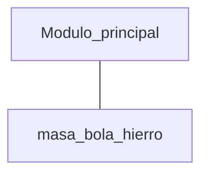

# Práctica 5: Diseño Modular: construcción de módulos


## Ejemplos de diseño modular

### Masa_Bola_Hierro


- Nombre del módulo: 	masa_bola_hierro

- Actividad funcional
  - El módulo a construir realiza varias actividades funcionales (entrada de  por teclado, cálculo de  y presentación de resultados en pantalla).

- Interfaz (lista de parámetros formales)	
  - El subprograma no comunica información con ningún otro subprograma. Todo su trabajo funcional lo realiza sin información de entrada por parte de otros módulos y no devuelve ningún resultado a otros módulos.
  El sub-programa a construir es de tipo procedimiento dado que no devuelve ningún valor especial asociado a su identificador de subprograma.

  Nota: este ejemplo lo único que pretende ilustrar es como se puede convertir un programa completo en un sub-programa sin argumentos.


- Prueba del módulo
    - Los subprogramas no se pueden ejecutar directamente. Para poder realizar pruebas unitarias de un módulo es necesario construir un programa completo que incluya dicho módulo. En nuestro caso vamos a construir un programa simple que consta de dos módulos, el módulo a probar y un módulo principal que activa dicho subprograma:





No obstante para la evaluación de los ejercicios de prácticas vamos a realizar un proceso de prueba adicional en donde los docentes proporcionarán un programa oculto para los alumnos (solo se proporciona el objeto ```.o```) que debe ser compilado junto con el código del alumno y que contiene la función.

 ________________________
[[openlink]](https://github.com/24-25-Programacion-44101107/_OpenProblemas/blob/main/CalcularMasaBolaHierroModular.c) 
______________________

Un visión alternativa del problema donde se utiliza la función para distintos tipos de materiales sería

[[openlink]](https://github.com/24-25-Programacion-44101107/_OpenProblemas/blob/main/CalcularMasaBolaModular.c) 


### Leer real en intervalo

Construir un subprograma que devuelva un número real introducido por teclado, cuyo valor esté comprendido en un intervalo, dados los extremos de dicho intervalo en cualquier orden; si ambos extremos del intervalo coinciden, devolver directamente dicho valor sin ningún procesamiento adicional.

- Nombre del módulo:	**LeerRealIntervalo**
- Actividad funcional	
  - La tarea funcional del módulo consiste en leer por teclado un nº real con la restricción de que dicho número esté comprendido dentro de un intervalo de dos valores reales. Nótese que este módulo tiene una funcionalidad limitada y específica (módulo de entrada de datos).

- Interfaz (lista de parámetros formales):
  -	Para poder realizar su trabajo funcional, este módulo requiere que se le indique a priori los extremos del intervalo, y el resultado que devuelve al módulo llamador es el dato (adecuadamente validado) introducido por teclado:

    E: a,b (real)  { extremos del intervalo }

    S: x (real)      { número leído por teclado }

  - El sub-programa se va a construir como un procedimiento (no devuelve ningún valor especial asociado a su identificador de subprograma). El único resultado se devuelve a través de la lista de parámetros formales.

- Diseño 
   - En el diseño del módulo se debería tener en cuenta la posibilidad de que los extremos del intervalo se den en cualquier orden (habría que ordenarlos dentro del módulo a construir), así como de que estos coincidan (en cuyo caso no se lee nada por teclado y se devuelve directamente uno de estos extremos):

- Prueba del módulo	
  - Los subprogramas no se pueden ejecutar directamente. Para poder realizar pruebas unitarias de un módulo es necesario construir un programa completo que incluya dicho módulo. En nuestro caso vamos a construir un programa simple que consta de dos módulos, el módulo a probar y un módulo principal que activa dicho subprograma:


[[openlink]](https://github.com/24-25-Programacion-44101107/_OpenProblemas/blob/main/LeerRealIntervalo.c) 


____________________________________

## Ejercicios a completar  de forma PRESENCIAL

______________________________________________


### **0.** Pruebas de funciones - EJERCICIO MÍNIMO REQUERIDO (**CalcularMasaBolaModularPR.c**) **(....masaBola(...))**

Como ya se ha indicado el proceso de pruebas y ENTREGA de los ejercicios  de funciones en un poco más complejo de lo visto hasta ahora. La entrega puede validar los ejercicios en dos aspectos que pueden darse ambos a la vez, pero cualquiera de ellos puede no utilizarse:

#### 1. Prueba de **entradas - salidas**


El primero de ellos ya es conocido  y  utiliza: ```INICIO_TEST(), PRINT_TEST(), FIN_TEST()```, además de un archivo "...PRTest.txt" que contiene los casos de prueba. Para que no utilizarlo sobre un ejercicio concreto basta  utilizar un archivo de casos de prueba vacío o simplemente no esté.  Debe recordarse que en la entrega los profesores utilizarán sus propios archivos de prueba.


#### 2. Prueba de las **definiciones** y resto de elementos
   
Puesto que lo importante es cómo se definan las funciones  y no tanto las entradas y salidas del programa de cara a la evaluación de las práctica, se hace necesario código adicional para la validación de cada ejercicio que se proporcionará al estudiante en un archivo objeto (extensión ```.o```) donde  se hará una verificación de los parámetros y prototipos de las funciones. También se puede hacer prueba de las entradas y salidas tal como se ha hecho hasta ahora.

Para esto se enlazará el programa con main elaborado por el estudiante donde están las funciones con el archivo ```.o``` 

Vamos a probar los módulos y para ello se utilizara una función llamada ```PROBAR()``` al principio o al final del principal controlado por la condición de que se esté probando el programa ```  if (argc > 1)  PROBAR(); ```. Implica la utilización de una plantilla un poco diferente de la utilizada hasta ahora. Por ejemplo el modulo principal también lo vamos a dotar de argumentos que nos facilitarán la prueba, recordemos que también es una función ```int main(int argc, char *argv[])```, incluso en algunos casos se indicará a los estudiantes que utilicen la función ```PROBAR```con determinados argumentos.

Cada ejercicio ```Eje1PR.c```por tanto requiere de 2 archivos de prueba:
    - Eje1PRTest.txt
    - Eje1PRTEST.o
  


En este ejercicio y partiendo de un ejemplo de codificación ya explicado, el estudiante comprobará ambos métodos de prueba y  entrega de prácticas. 

Es muy importante **respetar los nombres** asignados para los archivos y las funciones indicadas en cada ejercicio dentro de la documentación de la práctica. 

Por ejemplo en este ejercicio el archivo de código debe llamarse **CalcularMasaBolaModularPR.c** y la función/módulo que calcula la masa  **(... masaBola(...))**, los puntos suspensivos indican que los parámetros o valores devueltos por la función los fijará el estudiante en base a su solución al ejercicio.


La plantilla general de cualquier programa la mostramos a continuación y que esta en la carpeta de la práctica:

```c
 /* Librerías del ejercicio  */

#include "../.vscode/test/TEST.h"

/* Prototipos de funciones  del estudiante */

/*.....*/

// Funcion externa que se usa en validación  
// Esta en NombreArchivoPRTEST.o 

extern void PROBAR();


int main(int argc, char *argv[])
{

    INICIO_TEST();

  // llama a al test de la funcion de validación 
    if (argc > 1)  PROBAR();  


/* Programa principal del estudiante con
* las llamadas PRINT_TEST(..) que sean necesarias 
* según el enunciado del ejercicio y que puede 
* que no sean necesarias
*/

    FIN_TEST();   
    return 0;
}

/* Implementación funciones del estudiante */

```

Se debe utilizar este esquema para generar el archivo de código **CalcularMasaBolaModularPR.c** que fusione el archivo fuente con la solución modular al calculo de la masa de una bola de cualquier material (incorporado en la documentación) con la plantilla, ambos archivos se incluyen en la documentación de la práctica.


#### Incorporación de casos de prueba de Entrada - Salida

Para incorporar la validación de salidas que se corresponde con el conjunto de casos de prueba que están en el archivo ```CalcularMasaBolaModularPRTest.txt```. donde se prueba una bola de 12 cm de diámetro en un caso y el segundo caso donde se prueba primero con una bola dw 25 cm y después con otra de 12.

1. Se debe crear el archivo de pruebas CalcularMasaBolaModularPRTest.txt o bien copiarlo. 

```
12  N  | 7.11 9.49  ||
25  S 12 N  | 64.30 85.82 7.11 9.49  ||
```
La ```|``` marca la separación de entrada y salida y ```||``` el final del casos de prueba.

2. Después modificar el archivo **CalcularMasaBolaModular.c** para  incorporar las llamadas a PRINT_TEST que se muestran a continuación, además de ```INICIO_TEST()``` y ```FIN-TEST()```. Renombrar el archivo como **CalcularMasaBolaModularPR.c**


```c
        printf("\nMasa para una bola de hierro: %.2f Kg", masaBola(diametro, FE));
        PRINT_TEST("%.2f ", masaBola(diametro, FE));
        
        printf("\nMasa para una bola de plata: %.2f Kg", masaBola(diametro, AG));
        PRINT_TEST("%.2f ", masaBola(diametro, AG));
```

3.  Ejecutar la Prueba, el resultado será similar a:

```

---PASA: Salida Correcta para entrada '12 N'
---PASA: Salida Correcta para entrada '25 S 12 N'
 
Se pasan todas las pruebas.
```


#### Incorporación de  prueba de funciones

1. Incorporar la llamada a la función de validación, el inicio de main será:

```c
int main(int argc, char *argv[])
{
    INICIO_TEST();
    if (argc > 1)  PROBAR();  

...
```
2. El archivo  **CalcularMasaBolaModularPR.c** se debe **compilar** para incluir la funcion externa que ejecuta el test de las funciones (```PROBAR```) que esta en **CalcularMasaBolaModularPRTEST.o** (incluido en documentación).


El archivo fuente de prueba de funciones **...PRTEST..** que salvo en este ejemplo **NUNCA** será visible para los estudiantes tendrá un contenido similar al mostrado pero **no** se podrá manipular ni modificar:

```c
#include <assert.h>
#include <stdio.h>
#include <stdlib.h>      
#include <math.h>
#include "../.vscode/test/TEST.h"

extern float masaBola(float diametro, float densidad);
void PROBAR() {

    float x;
    int a;
    
    x = masaBola(12, 0.00786);
    x=x*100;
    a=trunc(x);
    assert((a == 711));

    x = masaBola(12, 0.01049);
    x=x*100;
    a=trunc(x);
    assert(a == 949);

    x = masaBola(12.0, 0.02);
    x=x*100;
    a=trunc(x);
    assert(a == 1809);
    
    x = masaBola(14.0, 0.02);
    x=x*100;
    a=trunc(x);
    assert(a == 2870);

}
```
4. Tras lanzar la prueba el resultado será similar a:

```

---PASA: Salida Correcta para entrada '12 N'
---PASA: Salida Correcta para entrada '25 S 12 N'

Se pasan todas las pruebas.

```


[( - ```  ```   ](../PR5_resuelta/CalcularMasaBolaModularPR.c)[[link privado]](https://github.com/24-25-Programacion-44101107/_PracticasLaboratorioPrivado/blob/main/PR5_resuelta/CalcularMasaBolaModularPR.c) 


### **1.**  Devolver un real - dos alternativas - EJERCICIO MÍNIMO REQUERIDO **LeerRealIntevaloPR.c** **(..leerRealIntervalo1(..)  ..leerRealIntervalo2(..)  ..leerRealIntervalo3(..))**
 Modificar el módulo *LeerRealIntervaloPR*, generando diversas versiones del módulo.
 
 
 ```c 
 void leerRealIntervalo1(float a, float b, float *x){
    if(a==b)
          *x=a;
    else{ if(a>b){
               *x=a;
               a=b;
               b=*x;
          }
          do{ printf("\nIntroduzca numero en [%.0f,%.0f]: ",a,b);
              scanf(" %f",x);
          }while((*x<a)||(*x>b));
    }
}
 ```
 
 para tener una función con ese nombre que devuelva el valor del real en lugar de utilizar un parámetro de salida.

```c
float leerRealIntervalo2(float a, float b)
```

 Modificar el programa original para que la función lea un real en un intervalo pero solo permita 3 intentos y si se superan, devuelva un error. 

 ```c
int leerRealIntervalo3(float a, float b, float *x){
```

No hace falta poner PRINT_TEST(), están implicitos en la prueba


[( - ```  ```   ](../PR5_resuelta/LeerRealIntervaloPR.c)[[link privado]](https://github.com/24-25-Programacion-44101107/_PracticasLaboratorioPrivado/blob/main/PR5_resuelta/LeerRealIntervaloPR.c) 


### **2.** Coordenadas Polares (PasarPolaresPR.c)


 Construir un subprograma para pasar de coordenadas  cartesianas bidimensionales a coordenadas polares. El programa leerá por teclado las coordenadas cartesianas e imprimirá en pantalla las coordenadas polares correspondientes utilizando una funcion llamada **... polares(...)**, recuerda los parámetros de entrada se ponen antes que los de salida y el orden es el que aparece en los casos de prueba (esta condición es obligatoria para la evaluación correcta del ejercicio). 
 
 En este ejercicio solo se prueba la funcion, es decir que no habrá **PRINT_TEST** en el ejercicio del alumno. En el programa principal el estudiante podrá poner el contenido que crea necesario para desarrollar su ejercicio y verificarlo, pero no se evaluará.

  $x = r * cos(\theta)$
  $y = r * sen(\theta)$
 
 
 
 
 **Datos de prueba**

| (x,y)   | $(r,\theta)$      |
|---------|------------|
| (0,0)   | (0,0)      |
| (1,0)   | (1,0)      |
| (0,1)   | (1,90)     |
| (-1,0)  | (1,180)    |
| (0,-1)  | (1,270)    |
| (1,1)   | (1.41,45)  |
| (-1,1)  | (1.41,135) |
| (-1,-1) | (1.41,225) |
| (1,-1)  | (1.41,315) |
| (0,-1)  | (1-90)     |

 
[( - ```  ```   ](../PR5_resuelta/PasarPolaresPR.c)[[link privado]](https://github.com/24-25-Programacion-44101107/_PracticasLaboratorioPrivado/blob/main/PR5_resuelta/PasarPolaresPR.c) 


### **3.** Función Tabla de potencias (TablaPotenciasPR.c)

Realice una función llamada **TablaPotencias( n, a, b )**, que genere en pantalla la
tabla de potencias del numero decimal ```n``` recibido como parámetro entre los  valores definidos por el intervalo definido por ```a``` y ```b```.

Consideraciones sobre el ejercicio

- La base ```n``` a recibir en el parámetro solo puede variar entre -5 a 5 y nunca 0.
- Los límites deben estar entre -10 y 10.
- Ante cualquier numero fuera de este rango se volverá a repetir la entrada hasta obtener un dato válido. 
- ```a``` y ```b``` podrán darse en cualquier orden igual que se implementa en ```leerRealIntervalo```.
- Se trabajarán con potencias de bases y exponentes enteros, aunque su resultado puede ser real por los exponentes negativos.
- Se debe usar la función ```leerRealIntervalo``` en su versión 1 o 2, ojo aplicar cast para tener un entero (int).
- No puede usar a la librería math.h

- Se debe crear otra función complementaria a la función solicitada llamada ```...potencia(...)``` que devuelva un ```0``` para representar la indeterminación y que dados como argumento el número base (real) y el exponente (entero), devuelva el valor de la potencia sobre otro argumento de acuerdo con los siguientes casos. Se debe tener en cuenta que 0 como base si debe estar contemplado el al función **potencia**.

En la función **TablaPotencias** debe haber una llamada o las que sean necesarias a la función **potencia**

```c
        // llamada a potencia para obtener resultado
        printf("%d ^ %d = %.3f\n", n, i, resultado);
        PRINT_TEST("%f ", resultado);
```

|parámetros de entrada|Salida de ```potencia```|
|---|---|
| 2<sup>10</sup>	|	1024.000 (1)
| 	3<sup>4</sup>	|	    81.000 (1)
| 	2<sup>-2</sup>	|	      0.250 (1)
| 	1<sup>0</sup>	|	      1.000 (1)
| 	0<sup>1</sup>	|	      0.000  (1)
| 	0<sup>0</sup>	|	Indeterminación (0)
| 	0<sup>-1</sup>	|	Indeterminación (0)

La indeterminación se puede asumir que vale 0 pero con un valor de control a 0.


[( - ```  ```   ](../PR5_resuelta/TablaPotenciasPR.c)[[link privado]](https://github.com/24-25-Programacion-44101107/_PracticasLaboratorioPrivado/blob/main/PR5_resuelta/TablaPotenciasPR.c) 


____________________________________________________
## Ejercicios a completar  de forma NO PRESENCIAL
____________________________________________


### **Ejercicio 4.** Bisiesto (BisiestoPR.c)

Construir y probar una función que lea por teclado un año y calcule y muestre si es bisiesto. 
La función bisiesto recibe el año leído por teclado, comprueba si es o no bisiesto y devuelve 1 si lo es ó 0 si no lo es.

Sabemos que un año es bisiesto si:

1.  Si el año es uniformemente divisible por 4, vaya al paso 2. De lo contrario, vaya al paso 5.
2.  Si el año es uniformemente divisible por 100, vaya al paso 3. De lo contrario, vaya al paso 4.
3.  Si el año es uniformemente divisible por 400, vaya al paso 4. De lo contrario, vaya al paso 5.
4.  El año es un año bisiesto (tiene 366 días).
5.  El año no es un año bisiesto (tiene 365 días)


La validación de este ejercicio se realizará como validación de entrada-salida, por lo que el programa principal solo contendrá el código que lee un año y compruebe si es bisiesto o no. 


**Datos de prueba**

| Año  | Bisiesto |
|------|----------|
| 1980 | Sí       |
| 1981 | No       |
| 1984 | Sí       |
| 1985 | No       |
| 1992 | Sí       |
| 2000 | Sí       |
| 2001 | No       |
| 2012 | Sí       |
| 2018 | No       |
| 2020 | Si       |
| 2023 | No       |


[( - ```  ```   ](../PR5_resuelta/EsBisiestoPR.c)[[link privado]](https://github.com/24-25-Programacion-44101107/_PracticasLaboratorioPrivado/blob/main/PR5_resuelta/EsBisiestoPR.c) 


### **Ejercicio 5.** (AckermannPR.c)

En teoría de la computación, la función de Ackermann es una función recursiva que toma dos números naturales como
argumentos y devuelve un único número natural. Escriba un programa en C, que determine la serie de Ackermann cuando se proporcionan los parámetros m y n. Como norma general se define como sigue:

```
A(m,n)=
    n+1 con m=0
    A(m-1,1) si m>0 y n=0
    A(m-1,A(m,n-1)) si m>0 y n>0
```

En este caso también se validará solo la entrada salida  para lo que el programa principal solo leerá m y n y mostrará la salida de la función de Ackermann construida.

**Datos de prueba**

| Caso | Entrada (m, n) | Salida Esperada |
|------|----------------|-----------------|
| 1    | (0, 0)         | 1               |
| 2    | (0, 5)         | 6               |
| 3    | (1, 0)         | 2               |
| 4    | (1, 2)         | 4               |
| 5    | (2, 2)         | 7               |
| 6    | (3, 2)         | 29              |


[( - ```  ```   ](../PR5_resuelta/AckermannPR.c)[[link privado]](https://github.com/24-25-Programacion-44101107/_PracticasLaboratorioPrivado/blob/main/PR5_resuelta/AckermannPR.c) 
