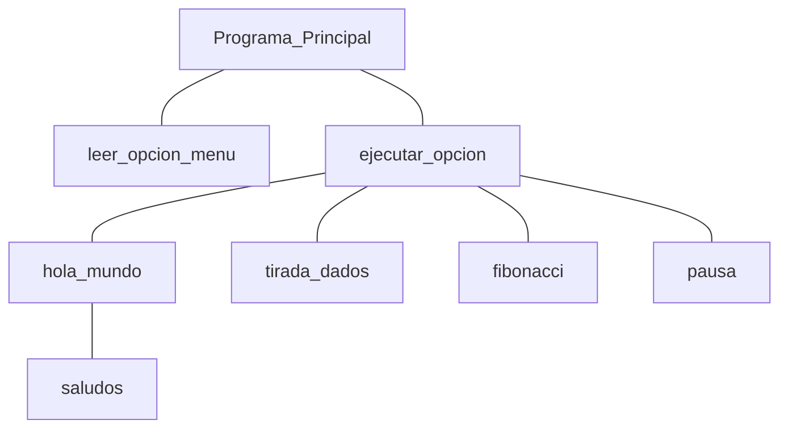

# Práctica 6: Descomposición modular 


## Ejemplos de programas

Es muy habitual que los programas presenten un menu de opciones similar al mostrado a continuación

De esta forma el programa tiene la siguiente estructura de módulos. En los diagramas se utiliza la notación snake case, pero en la implementación se debe utilizar camel case.





[[openlink]](https://github.com/24-25-Programacion-44101107/_OpenProblemas/blob/main/Menu.c)


_________________________
## Ejercicios a completar  de forma PRESENCIAL
____________________________________________

### **0.** Menu de opciones - EJERCICIO MÍNIMO REQUERIDO (MenuPR.c)
Probar el ejemplo de menu incluido en ```_OpenProblemas```.

Utilizar los casos de prueba incluidos. 

[( - ```  ```   ](../PR6_resuelta/MenuPR.c)[[link privado]](https://github.com/24-25-Programacion-44101107/_OpenProblemas/blob/main/Menu.c) 


### **1.** Menu de opciones - EJERCICIO MÍNIMO REQUERIDO (MenuDosNumerosPR.c)
Para el siguiente ejemplo se van a reutilizar algunos de los ejemplos vistos en trabajos anteriores. Se partirá de dos enteros positivos leídos desde teclado. A partir de aquí, presentar al usuario un menú con las siguientes opciones disponibles:
> 1.	Calcular y mostrar el máximo común divisor de los datos
> 2.	Calcular y mostrar el máximo de dos números enteros
> 3.    Cambiar los números leídos por otros
> 4.	Finalizar ejecución

[( - ```  ```   ](../PR6_resuelta/MenuDosNumerosPR.c)[[link privado]](https://github.com/24-25-Programacion-44101107/_PracticasLaboratorioPrivado/blob/main/PR6_resuelta/MenuDosNumerosPR.c) 


### **2.** Fechas (MenuFechasPR.c)

Realizar un programa en C que trabaje una fecha que se representará con tres variables: día, mes y año. La lectura de la fecha implica la validación (ValidarFecha) que a partir de un día, mes y año comprueba si la fecha es correcta, devolviendo 1 en caso de fecha correcta, sobre el nombre de la función. Considerar los años bisiestos función (esBisiesto) durante la validación. A partir de una fecha inicial (se debe inicializar a 1-1-2023), se podrá cambiar la fecha o bien sumar n días (```void sumarDias(int *dia, int *mes, int *anno, int dias)```). El menú de opciones es el siguiente:

> 1.	Cambiar fecha
> 2.	Sumar n días a la fecha
> 3.    Mostrar fecha
> 4.	Finalizar ejecución


[( - ```  ```   ](../PR6_resuelta/MenuFechasPR.c)[[link privado]](https://github.com/24-25-Programacion-44101107/_PracticasLaboratorioPrivado/blob/main/PR6_resuelta/MenuFechasPR.c) 


____________________________________________________
## Ejercicios a completar  de forma NO PRESENCIAL
____________________________________________


### **Ejercicio 3.** Circunferencia para tres Puntos no colineales (CircunferenciaTresPuntosPR.c)

Construir un programa que lea por teclado las coordenadas bidimensionales de 3 puntos diferentes no colineales (que no estén en la misma línea recta), y que calcule e imprima en pantalla el centro y el radio de la circunferencia que definen.

Nota: centro **$(x_c,y_c)$** y radio **r** de la circunferencia que pasa por 3 puntos no colineales **$(x_1,y_1)$**, **$(x_2,y_2)$** y **$(x_3,y_3)$**:

$y_c =[(x_1 -x_3 )*(x_1 -x_2 )*(x_2 -x_3 )+(x_1 -x_3 )*(y_1^2-y_2^2)-(x_1-x_2)*(y_1^2-y_3^2]/[2*(x_1 -x_3 )*(y_1 -y_2 )-2*(x_1 -x_2 )*(y_1 -y_3 )]$

$x_c =[(y_1 -y_3 )*(y_1 -y_2 )*(y_2 -y_3 )+(y_1 -y_3 )*(x_1^2-x_2^2)-(y_1 -y_2 )*(x_1^2-x_3^2)]/[2*(y_1 -y_3 )*(x_1 -x_2 )-2*(y_1 -y_2 )*(x_1 -x_3 )]$

$r^2=(x _1 -x _c )^2+(y _1 -y _c )^2$

Nota: para comprobar que 3 puntos en el plano están o no en la misma línea, formar dos vectores con los mismos ($V_1$ y $V_2$), calcular el producto vectorial y si este es el vector nulo entonces los 3 puntos están alineados en línea recta:


$V_1=P_1-P_2$
$V_2=P_3-P_2$

$V_1 \land V_2= |V_1|*|V_2|*seno(\theta)$

**Datos de prueba**

|$(x_1 ,y_1 )$	|$(x_2 ,y_2 )$|	$(x_3 ,y_3 )$	|$(x_c ,y_c )$|	r|
|---|---|---|---|---|
(0,5)|	(5,0)|	(0,-5)|	(0.00,0.00)	|  5.00
(0,0)|	(5,5)|	(10,10)		
(0,0)|	(2,2)|	(10,8)	|(33.00,-31.00)|	45.28


[( - ```  ```   ](../PR6_resuelta/CircunferenciaTresPuntosPR.c)[[link privado]](https://github.com/24-25-Programacion-44101107/_PracticasLaboratorioPrivado/blob/main/PR6_resuelta/CircunferenciaTresPuntosPR.c) 
